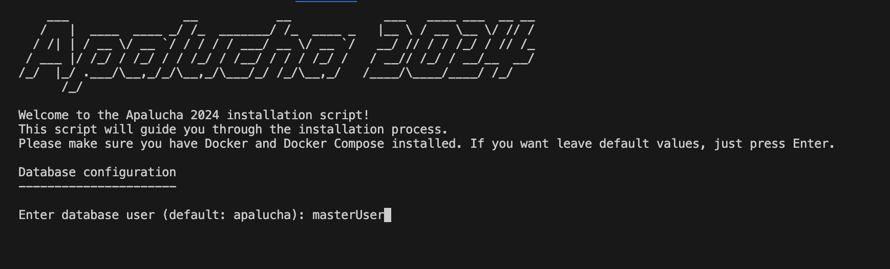
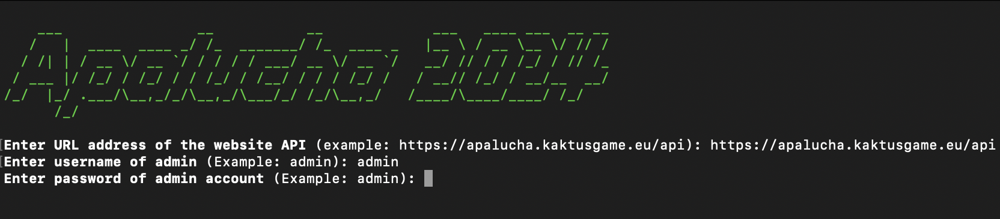
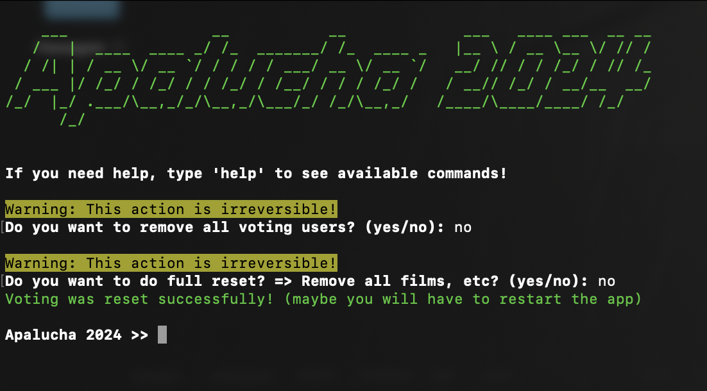
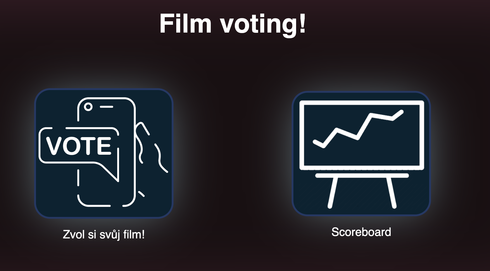
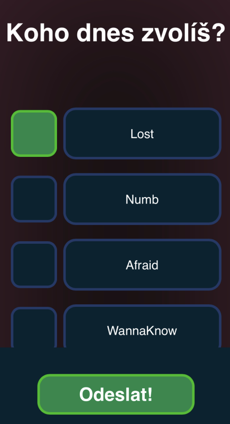
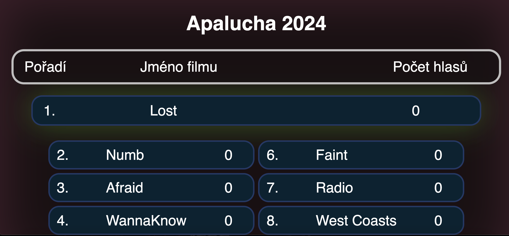

# Apalucha

This is a simple web application made for voting (mainly for films). Frontend is made with React and typescript, backend is made with Python and Flask. Application made for managment (like adding/removing films, users) is made in C#. Everything is dockerized and can be run with docker-compose.

## Installation

Installation is easy, just clone this repository and run install.sh script. You will need to have docker and docker-compose installed.

```bash
gh repo clone Kaktus1549/Apalucha
cd Apalucha
./install.sh
```

Install script will ask you for some configuration, like ports for docker containers, URL address, master user, etc.



The script will create a .env files with your configuration so backend and frontend can use it.

## Usage

After installation, you will have to setup something like nginx or apache to serve frontend and backend. 
Here is an example of nginx configuration:

```nginx
server {
    listen 80;
    server_name apalucha.kaktusgame.eu;
    return 301 https://$host$request_uri;
}

server {
    listen 443 ssl;
    server_name apalucha.kaktusgame.eu;
    ssl_certificate /etc/letsencrypt/live/apalucha.kaktusgame.eu/fullchain.pem;
    ssl_certificate_key /etc/letsencrypt/live/apalucha.kaktusgame.eu/privkey.pem;

    location / {
   	proxy_pass http://127.0.0.1:5000/;
        proxy_pass_request_headers on;
        proxy_set_header X-Real-IP $remote_addr;
    }
    location /pdf {
        proxy_pass http://127.0.0.1:3000/pdf;
        proxy_pass_request_headers on;
        proxy_set_header X-Real-IP $remote_addr;
    }

    location /api/ {
        proxy_pass http://127.0.0.1:15213/;
        proxy_pass_request_headers on;
        proxy_set_header X-Real-IP $remote_addr;
    }
}
```

### Application

Application is written in C# and is used for managment of the application. After starting the application you will be asked for the URL of the backend API. Then you will be asked for the admin credentials. 



After that, you can add/remove films, users, and see the results of the voting. You can also restart the voting or reset it (delete all votes, remove all films).




### Frontend

Frontend is made with React and typescript. There are 4 main pages: root page, login page, voting page, and scoreboard page.

#### Root page

Root page is the main page of the application. There are two big buttons, one leads to voting page, and the other to the scoreboard page.



("Zvol si svůj film" means "Choose your film")

#### Voting page

For voting you will need voting (normal) user token, which you can get from QR code in PDF file. As admin you can add normal users via application, which will return PDF URL with QR code. You can then distribute this PDF to users. When voting starts, user will see list of films and can vote for one of them. After selecting film, "Odeslat" button will appear, which will send the vote to the backend.




#### Scoreboard page

When you open the scoreboard page, you will see the start button. When you click on it, the voting will start. After the voting ends, you will see button "Show results" which will show the results of the voting.



#### Login page

Login page is used for admin login. You can login with username and password, which you can set via application. QR codes have this URL with ?token=\<token\> parameter, which will log you in automatically.